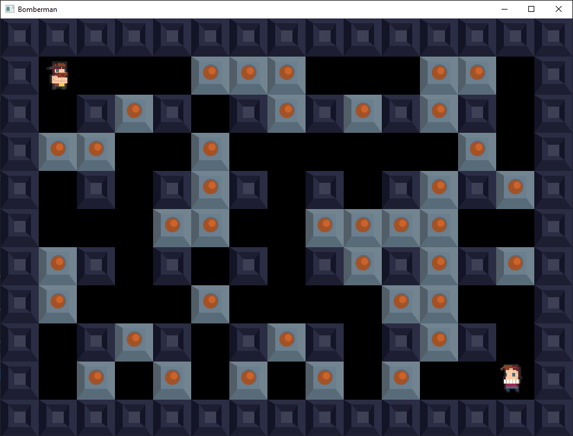
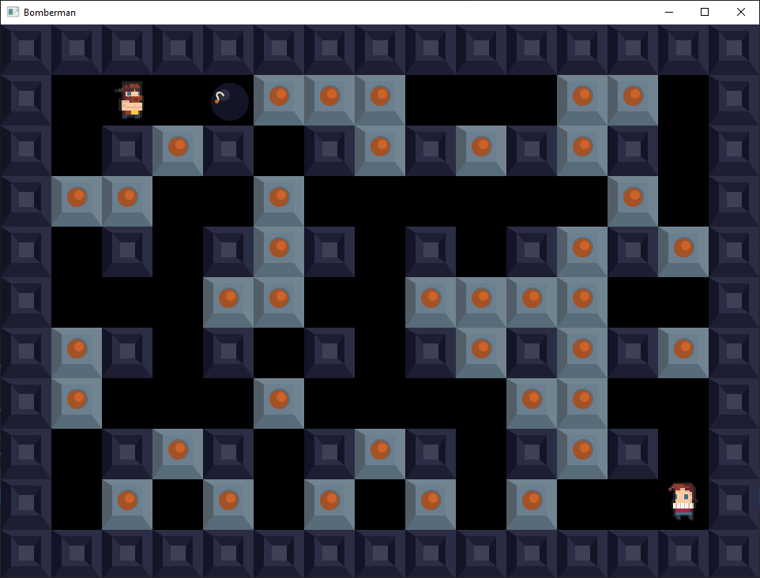
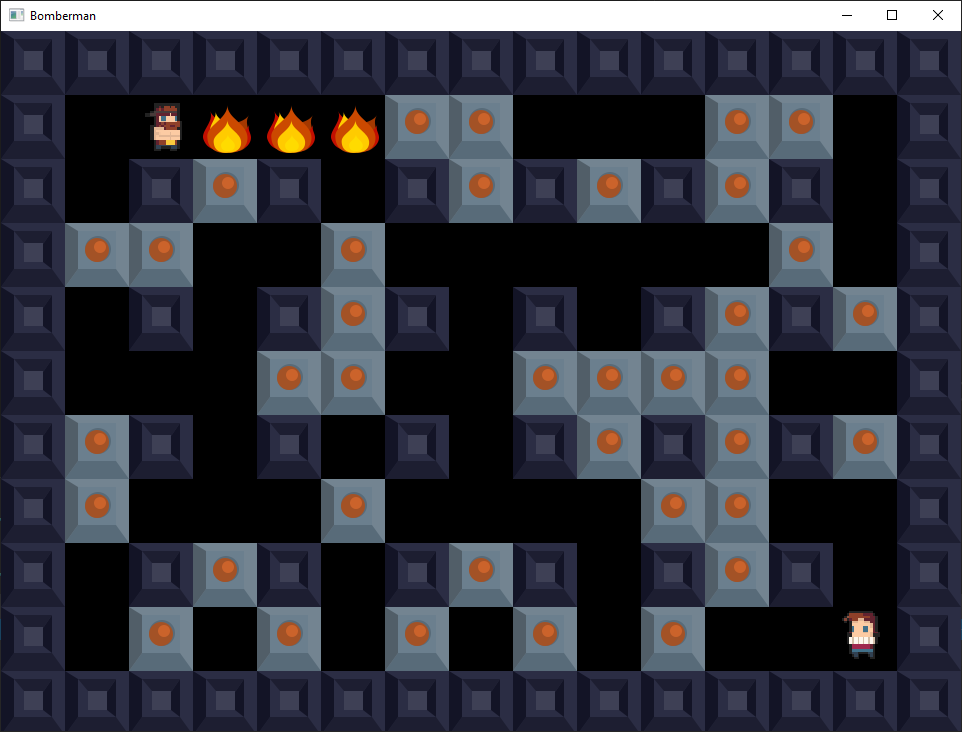
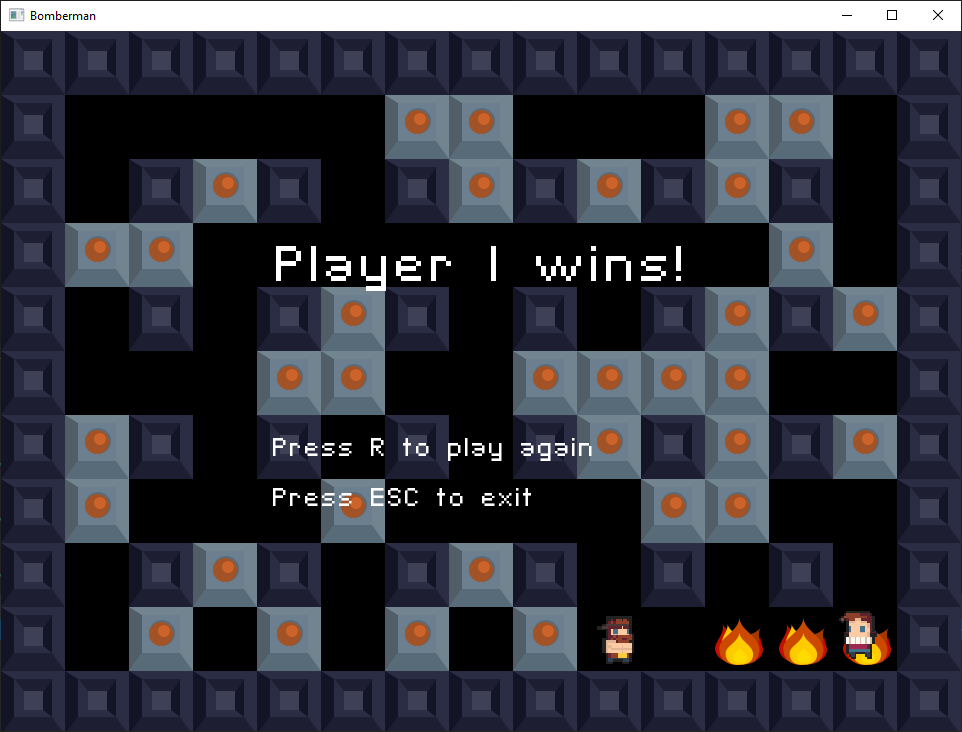

# Bomberman
Bomberman game in c++ using SFML. This version of game provides multiplayer gameplay on single computer. Work on version 2.0 providing LAN gameplay is in progress.

## Controls
<b>Player 1:</b>
<ul>
  <li> Movement: W, S, A, D
  <li> Planting bomb: Space
</ul>

<b>Player 2:</b>
<ul>
  <li> Movement: UP, DOWN, LEFT, RIGHT
  <li> Planting bomb: Right Shift
</ul>

## Map
Map as .txt file is loaded from <i>res/map/Map.txt</i> (if you want to modify game map, feel free to change this file).
<ul>
  <li> <b>2</b> - solid block
  <li> <b>1</b> - breakable block
  <li> <b>0</b> - background block
</ul>

## Statistics
Statistics of all played games are saved in .txt file in <i>res/stats/statistics.txt</i>, including date, time, winner and amount of bombs planted by each player.

## Scrennshots

